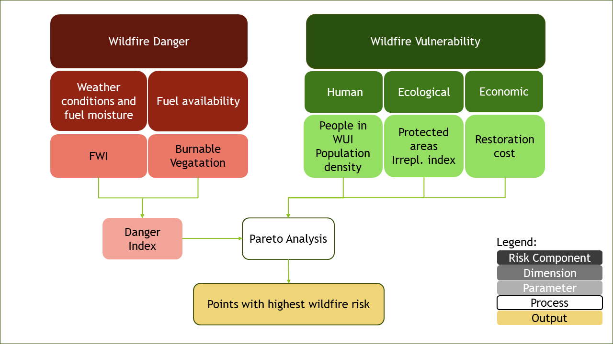

# FWI Risk Assessment Description

## Aim
In this workflow we will produce an assessment of wildfire development risk based on the seasonal Fire Weather Index and a range of parameters linked to wildfire vulnerability. On one hand, this workflow provides a simple tool to assess which areas of a region have the most suitable setting for wildfire development based on climatic conditions and fuel availability. On the other, it informs the users on which areas are the most vulnerable to wildfire from a human, economic and environmental point of view. Synthetizing infromation about wildfire danger and vulnerability, the workflow finally produces an assessment of wildfire risk, pointing out which areas should be prioritised by adaptation measures.

## Methodology
Wildfire risk is defined following the approach of the European Forest Fire Information System (EFFIS), characterizing it as the combination of wildfire danger and vulnerability [(Jacome Felix Oom, 2022)](https://publications.jrc.ec.europa.eu/repository/handle/JRC130136). The figure below offers a schematic representation of the risk assessment methodology and lists the parameters used to define each risk component. 

Wildfire danger results from the interaction of favourable weather conditions to wildfire development and the presence of burnable vegetation. In this workflow, the former component is assessed using the Fire Weather Index (FWI). The FWI is a climatic index combining data on daily noon surface air temperature, rainfall intensity, wind speed and relative humidity accounting for the effect of fuel moisture and weather conditions on fire behaviour. It consists of a 0-100 score indicating how suitable the climate conditions are for the occurrence of wildfire. As it is only composed of climatic variables, climate models can be used to simulate future changes in daily and seasonal FWI values to get an estimate of how the fire weather hazard might evolve with climate change. Differently from the EFFIS methodology, this assessment does not consider the past burnt area as one of the components of wildifire risk. This is because, while showing a robust correlation with future fire activity in historically fire-prone areas, the burnt area parameter cannot be effectively used to predict fire occurrence in regions that have not yet experienced wildfires but will soon be under threat due to changing climatic conditions. Thus, as this workflow is meant to serve regions across the whole of Europe, this methodological approach minimises the occurrence of historical biases. To produce the fire danger indicator, FWI and burnable vegetation data are normalised and averaged assigning equal weights (see figure).

On the other hand, in line with EFFIS methodology, wildfire vulnerability is here defined as the combination of the human, ecological and socio-economic systems sensitive to wildfire occurrence. As shown in the figure, different parameters have been selected to represent these components, namely:
- **Population** living in the **Wildland Urban Interface**, representing the share of total population living in the periurban areas bounding forested or vegetated areas
- **Protected Areas** distribution, representing the share of each pixel of the map covered by a protected natural area
- **Ecosystem Irreplaceability Index**, representing the uniqueness and inherent value of the ecosystems present in each pixel
- **Population Density**
- **Ecosystem Restoration Cost** Index, representing the relative restoration cost of land in case of loss by wildfire

The danger indicator is combined with the vulnerability parameters through a Pareto analysis algorithm, which identifies the areas inside the region having the highest danger and vulnerability scores (see figure). The use of the Pareto analysis allows to introduce a fundamental element of novelty: the possibility for the user to independently choose which vulnerability parameters to include in the risk assessment, so that only the most relevant risk (i.e., human, ecological or economic) is taken into consideration. In addition, this approach allows users to easily introduce other vulnerability indicators than the provided ones based on their regional needs and embed them into the assessment.

## Data sources

The [seasonal](https://cds.climate.copernicus.eu/datasets/cems-fire-seasonal?tab=overview) and [daily](https://cds.climate.copernicus.eu/datasets/sis-tourism-fire-danger-indicators?tab=overview) Fire Weather Index data are produced by global and regional climate models and sourced from the Copernicus Climate Data Store. The burnable vegetation and all the vulnerability parameters are sourced from [EFFIS](https://forest-fire.emergency.copernicus.eu/apps/fire.risk.viewer/).
 
## Structure of the workflow
This workflow consists of two separate notebooks, one for the hazard assessment and one for the risk assessment. 

In the next pages you will find:

- FWI Hazard Assessment [notebook](FWI_Hazard_Assessment.ipynb), where you can explore FWI seasonal and daily data and get information of the projected changes of the fire weather season length in your region

- FWI Risk Assessment [notebook](FWI_Risk_Assessment.ipynb), where you can perform the wildfire risk assessment based on the seasonal FWI and the EFFIS vulnerability parameters.

## Contributors

Euro-Mediterranean Center on Climate Change [(CMCC)](https://www.cmcc.it), Italy.

Author of the workflow: Andrea Rivosecchi

